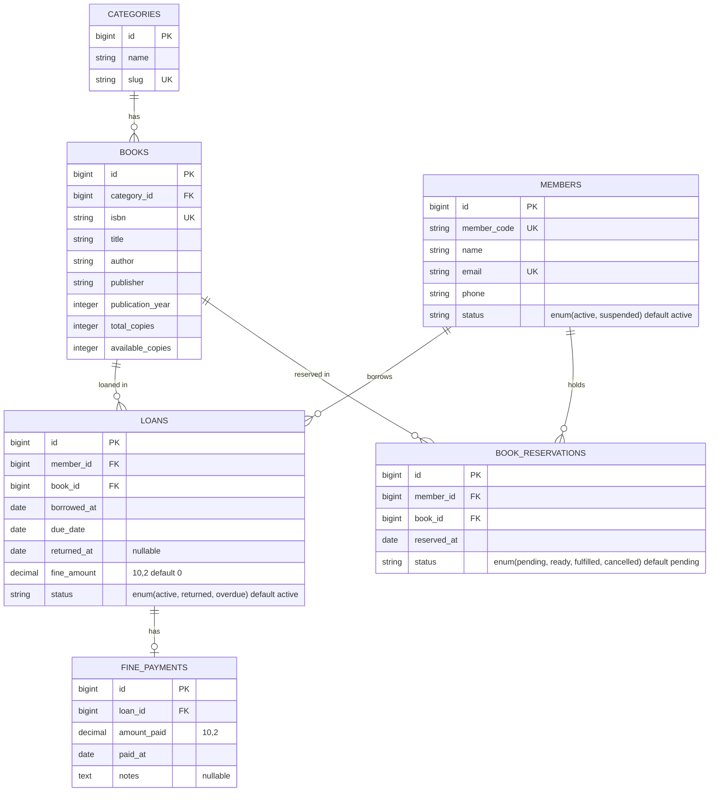
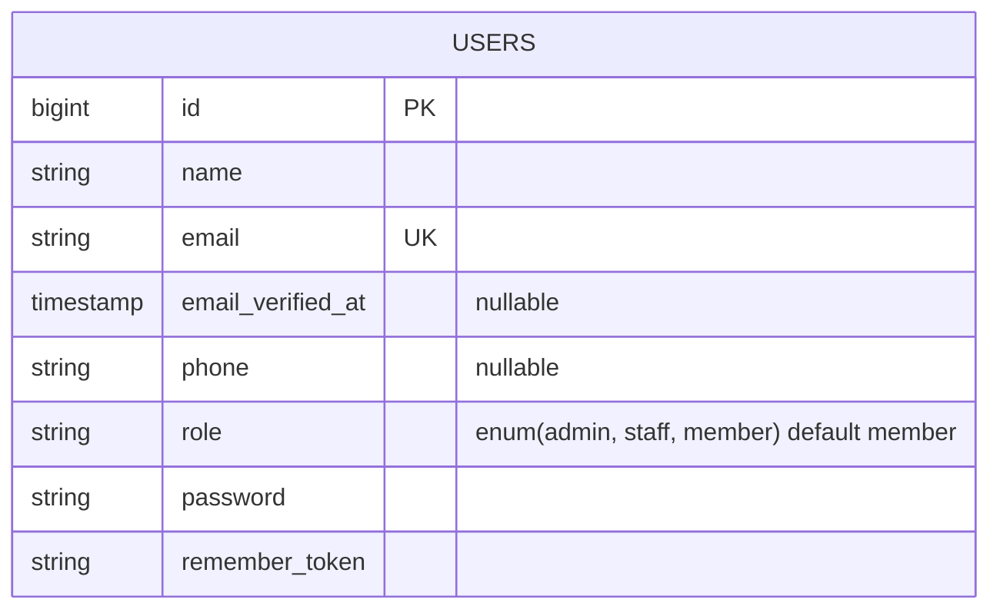

# ERD - Library Management App

> Diagram di bawah mengikuti **Database Schema (§3.3)** dari spesifikasi — 5 tabel inti, kolom persis seperti spec.
> Buka di VSCode lalu tekan `Ctrl+Shift+V` untuk lihat diagram (Mermaid sudah support bawaan VSCode).
> Semua perubahan tabel WAJIB diupdate di file ini dulu, baru migration.

## Tabel inti (sesuai §3.3)

## Tabel auth — TAMBAHAN di luar §3.3 (untuk fitur login/role)

Tabel `users` tidak ada di spec schema, tapi **dibutuhkan untuk auth** sesuai API contract (Access Level: Admin/Staff/Member) & Week 1 checkpoint (`/login`, `/register`).

## Relasi

| Sumber | Relasi | Tujuan | Keterangan |
|--------|--------|--------|------------|
| categories | 1 — N | books | satu kategori punya banyak buku (cascade delete) |
| books | 1 — N | loans | satu buku bisa dipinjam berkali-kali (cascade delete) |
| members | 1 — N | loans | satu member bisa punya banyak peminjaman (cascade delete) |
| loans | 1 — 0..1 | fine_payments | denda optional, bayar 1x per loan (cascade delete) |
| members | 1 — N | book_reservations | satu member bisa punya banyak hold buku (cascade delete) |
| books | 1 — N | book_reservations | satu buku bisa di-hold banyak member (cascade delete) |

## Catatan

- **`created_at` / `updated_at`** otomatis ditambah Laravel di semua tabel (tidak di-list di spec §3.3, tapi ada di DB).
- **`users.role`**: kolom sudah ada (di-normalisasi ke huruf kecil: `admin`, `staff`, `member`, default `member`). Dibuat lewat migration `add_role_to_users_table`.
- **`members` vs `users`** terpisah: `members` = peminjam, `users` = staff/admin yang login ke sistem.
- **`book_reservations`** (Week 3): tabel hold/reservasi buku. Alur: `pending` (nunggu stok) → `ready` (buku balik, siap diambil staff) → `fulfilled` (loan terbit) / `cancelled` (dibatalkan). Hanya bisa dibuat kalau `books.available_copies = 0`, max 5 hold aktif per member, hold pertama (FIFO) yang jadi `ready` saat return.
- Pengurangan/penambahan stock ada di `books.available_copies`, diupdate saat issue/return.
